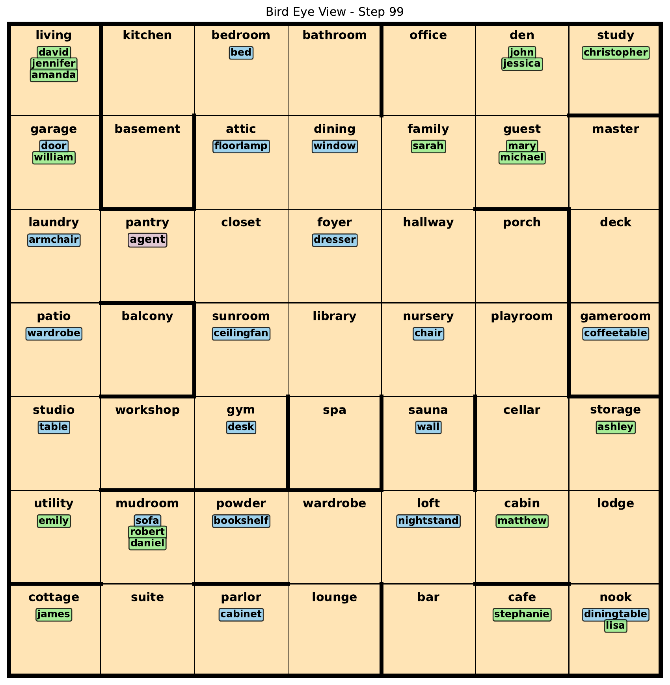
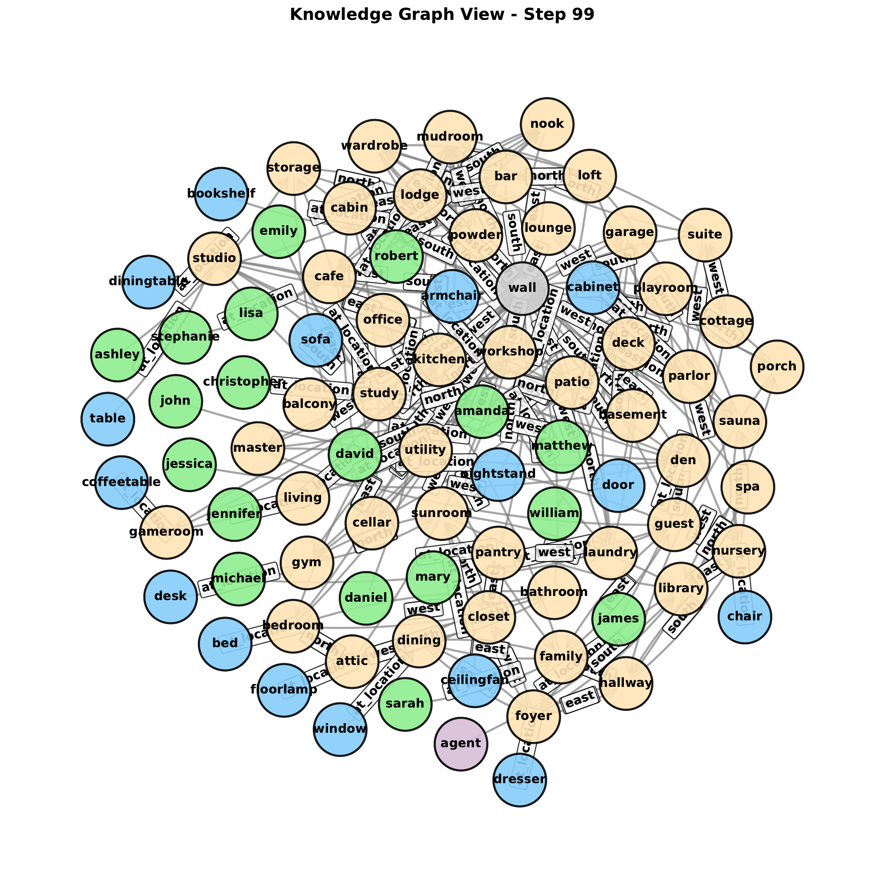
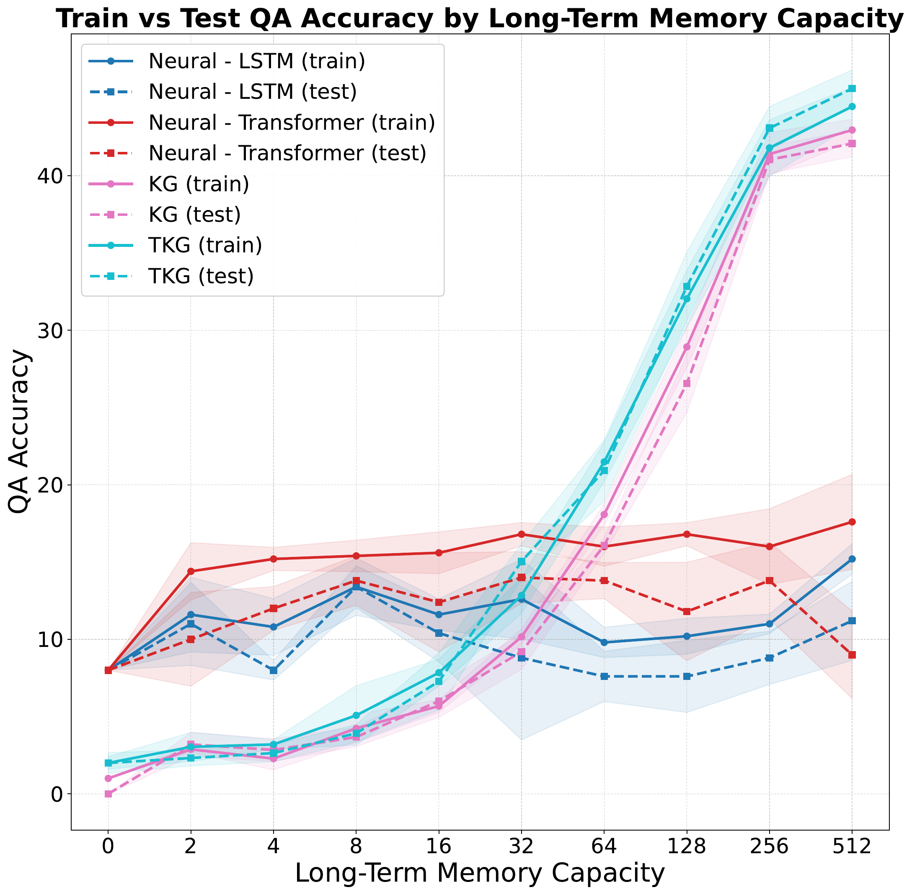
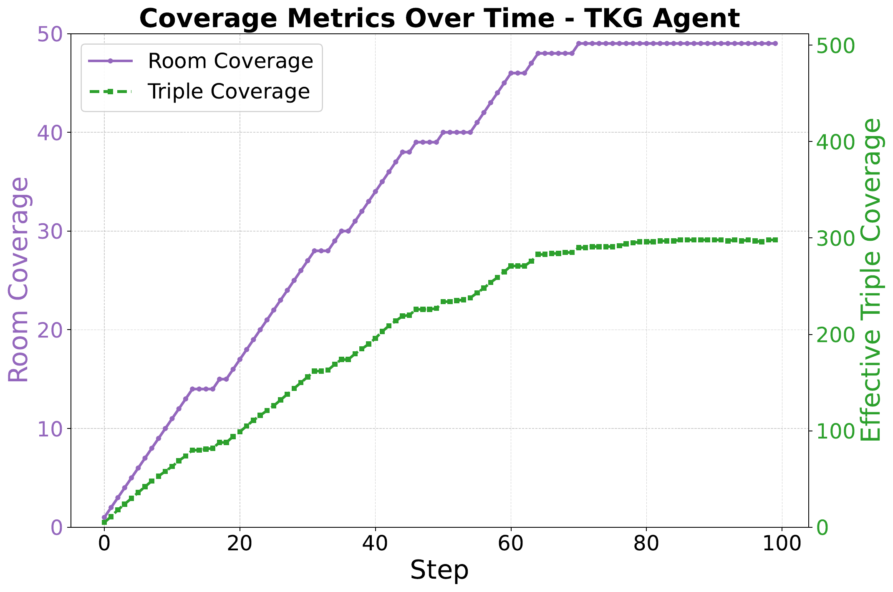

# Temporal Knowledge-Graph Memory in a Partially Observable Environment

This repository accompanies the RoomKG Benchmark, a neurosymbolic benchmark for studying long-term memory in partially observable environments.

Instead of treating memory as a side effect of policy learning, RoomKG makes it the main object of study: the hidden world state is an RDF knowledge graph, the observations are RDF triples, and agents must answer object-location queries while navigating a changing environment.

## ✨ Why this repo exists

- 🧭 A configurable benchmark for persistent memory under partial observability
- 🕸️ Symbolic baselines built around explicit KG and TKG memory
- 🤖 Neural baselines built around sequence-based observation history
- 📊 Reproducible figures, benchmark data, and paper artifacts

In the current benchmark setup, the symbolic TKG agent achieves roughly 4x higher test QA accuracy than the neural baselines under the same benchmark conditions.

## 🖼️ Preview

<p align="center">
	<a href="papers/Temporal-Knowledge-Graph-Memory-in-a-Partially-Observable-Environment/ns-ai-2026/figures/bird_eye_view_step_099.pdf">
		
	</a>
	<a href="papers/Temporal-Knowledge-Graph-Memory-in-a-Partially-Observable-Environment/ns-ai-2026/figures/graph_view_step_099.pdf">
		
	</a>
</p>

<p align="center">
	<a href="papers/Temporal-Knowledge-Graph-Memory-in-a-Partially-Observable-Environment/ns-ai-2026/figures/agent_train_test_qa_accuracy.pdf">
		
	</a>
</p>

<p align="center">
	<a href="papers/Temporal-Knowledge-Graph-Memory-in-a-Partially-Observable-Environment/ns-ai-2026/figures/coverage_metrics_tkg.pdf">
		
	</a>
</p>

Click any preview to open the original PDF figure.

## 🚀 Quick start

Install the dependencies:

```bash
uv pip install -r requirements.txt
```

Run the main benchmark scripts:

```bash
python run-symbolic.py
python run-symbolic-simple.py
python run-dqn-simple.py
python run-dqn-simple-test.py
```

## 📁 What to look at

- 📄 Paper source: [papers/Temporal-Knowledge-Graph-Memory-in-a-Partially-Observable-Environment/ns-ai-2026/main.tex](papers/Temporal-Knowledge-Graph-Memory-in-a-Partially-Observable-Environment/ns-ai-2026/main.tex)
- 🖼️ Paper figures (PDF): [papers/Temporal-Knowledge-Graph-Memory-in-a-Partially-Observable-Environment/ns-ai-2026/figures](papers/Temporal-Knowledge-Graph-Memory-in-a-Partially-Observable-Environment/ns-ai-2026/figures)
- 📦 Benchmark data bundle: [papers/Temporal-Knowledge-Graph-Memory-in-a-Partially-Observable-Environment/data](papers/Temporal-Knowledge-Graph-Memory-in-a-Partially-Observable-Environment/data)
- 📘 Environment analysis: [papers/Temporal-Knowledge-Graph-Memory-in-a-Partially-Observable-Environment/env-analysis.pdf](papers/Temporal-Knowledge-Graph-Memory-in-a-Partially-Observable-Environment/env-analysis.pdf)
- 📈 QA accuracy summary: [papers/Temporal-Knowledge-Graph-Memory-in-a-Partially-Observable-Environment/data/qa-accuracy-all.md](papers/Temporal-Knowledge-Graph-Memory-in-a-Partially-Observable-Environment/data/qa-accuracy-all.md)
- 📊 Coverage summary: [papers/Temporal-Knowledge-Graph-Memory-in-a-Partially-Observable-Environment/data/coverage_metrics.md](papers/Temporal-Knowledge-Graph-Memory-in-a-Partially-Observable-Environment/data/coverage_metrics.md)
- 🧠 Symbolic KG memory config: [papers/Temporal-Knowledge-Graph-Memory-in-a-Partially-Observable-Environment/data/memory-kg.yaml](papers/Temporal-Knowledge-Graph-Memory-in-a-Partially-Observable-Environment/data/memory-kg.yaml)
- 🕰️ Temporal KG memory config: [papers/Temporal-Knowledge-Graph-Memory-in-a-Partially-Observable-Environment/data/memory-tkg.yaml](papers/Temporal-Knowledge-Graph-Memory-in-a-Partially-Observable-Environment/data/memory-tkg.yaml)
- 🤖 LSTM memory config: [papers/Temporal-Knowledge-Graph-Memory-in-a-Partially-Observable-Environment/data/memory-lstm.yaml](papers/Temporal-Knowledge-Graph-Memory-in-a-Partially-Observable-Environment/data/memory-lstm.yaml)
- 🔁 Transformer memory config: [papers/Temporal-Knowledge-Graph-Memory-in-a-Partially-Observable-Environment/data/memory-transformer.yaml](papers/Temporal-Knowledge-Graph-Memory-in-a-Partially-Observable-Environment/data/memory-transformer.yaml)
- 🧩 Memory state graph exports: [papers/Temporal-Knowledge-Graph-Memory-in-a-Partially-Observable-Environment/data/memory_state_graphs](papers/Temporal-Knowledge-Graph-Memory-in-a-Partially-Observable-Environment/data/memory_state_graphs)

## 🗂️ Repository layout

- `agent/`: agent implementations and neural modules
- `run-symbolic.py`: full symbolic benchmark run
- `run-symbolic-simple.py`: simplified symbolic run
- `run-dqn-simple.py`: neural baseline training run
- `run-dqn-simple-test.py`: neural baseline test run
- `papers/`: manuscript, benchmark artifacts, figures, and data summaries
- `assets/readme/`: PNG previews used by this README

## 📌 Notes

- The manuscript and benchmark artifacts use RDF 1.2 annotation terminology.
- The README previews are PNG conversions of the PDF figures shipped with the paper.
- The full benchmark context, figures, and supporting analyses live under the `papers/` directory.