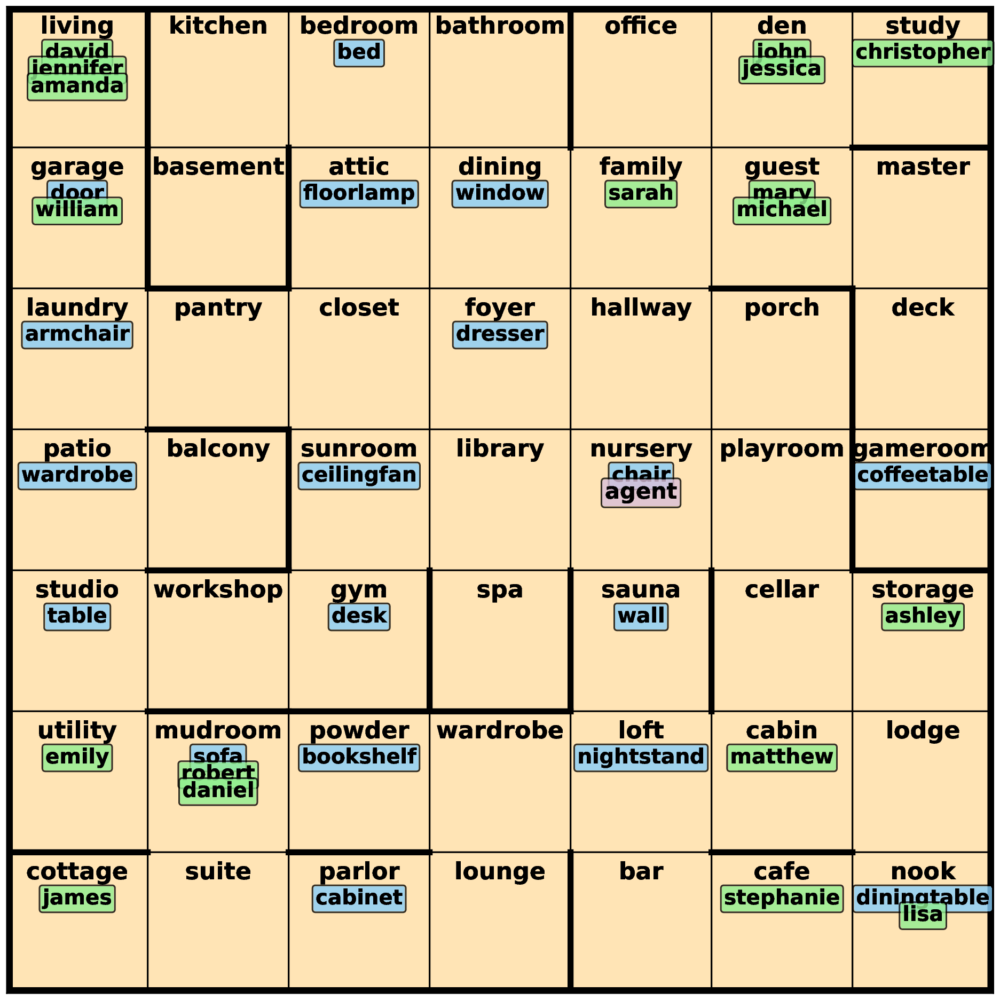
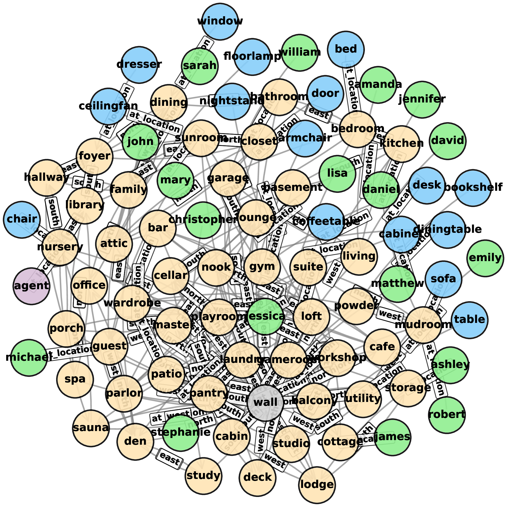
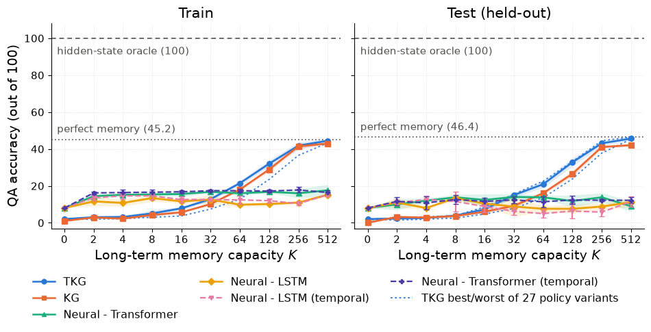
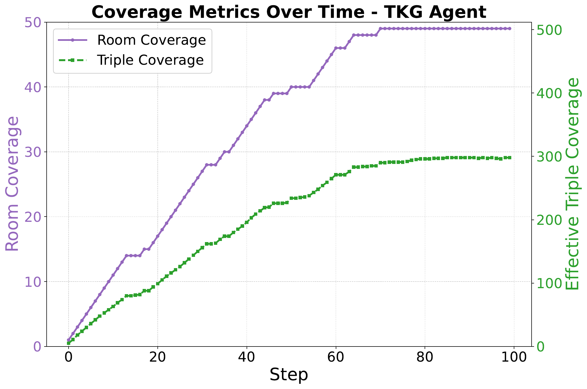

# RoomKG Baselines

**Authors:** [Taewoon Kim](https://taewoon.kim/), [Vincent Francois-Lavet](http://vincent.francois-l.be/), and [Michael Cochez](https://www.cochez.nl/).

Code for symbolic and neural baselines that operate in
[RoomEnv-v3](https://github.com/humemai/room-env), the RoomKG
benchmark.

For the research overview, see the [project page](https://humem.ai/projects/roomkg-baselines)
or the paper on [arXiv](https://arxiv.org/abs/2408.05861).

This README focuses on the code, setup, benchmark entry points, and reproduced results
in this repository.

## Repository layout

- [`agent/`](./agent): symbolic agents, neural agents, and shared benchmark logic
- [`run-symbolic.py`](./run-symbolic.py): full symbolic benchmark sweep over QA and exploration policies
- [`run-symbolic-simple.py`](./run-symbolic-simple.py): simplified symbolic baseline sweep
- [`run-dqn-simple.py`](./run-dqn-simple.py): neural baseline training sweep for LSTM and Transformer agents
- [`run-dqn-simple-test.py`](./run-dqn-simple-test.py): test-time evaluation for completed neural training runs
- [`figures/`](./figures): README figures and benchmark visualizations
- [`replay.py`](./replay.py): step the deterministic environment to any timestep and print its hidden state
- [`verify_claims.py`](./verify_claims.py): recompute every number the paper reports from `data/` and `results/`, and check the paper and response letter still assert them
- [`examples/memory-evolution/`](./examples/memory-evolution): the TKG agent's memory rendered at every timestep of one episode
- [`examples/memory-snapshots/`](./examples/memory-snapshots): serialized memory states in Turtle, in both the reification and RDF 1.2 encodings, with the converter and equivalence checker

## Prerequisites

1. Python 3.10 or higher
1. A virtual environment is recommended
1. Install the requirements with `uv pip install -r requirements.txt`

## Run the benchmark

Run the full symbolic sweep:

```sh
python run-symbolic.py --workers 4
```

Run the simplified symbolic baseline:

```sh
python run-symbolic-simple.py --workers 4
```

Train the neural baselines on one environment configuration:

```sh
python run-dqn-simple.py --env large-02 --workers 4
```

Evaluate completed neural training runs on the held-out environment:

```sh
python run-dqn-simple-test.py --env large-02-q --workers 1
```

The symbolic scripts write results under `training-results-symbolic/` and
`training-results-symbolic-simple/`. The neural scripts write training and test outputs
under `training-results-simple-dqn/`, or `training-results-simple-dqn-temporal/` when
`--temporal_features` is set.

## Benchmark setup

The repository compares four memory styles on the same partially observable task.

- **KG symbolic agent**: stores explicit RDF triples and answers queries by graph lookup
- **TKG symbolic agent**: stores annotated RDF triples with temporal metadata such as time added, last accessed, and recall count
- **LSTM neural baseline**: learns from tokenized observation histories
- **Transformer neural baseline**: learns from the same sequence-based observation histories with a Transformer encoder

The benchmark uses two related layouts, `large-02` and `large-02-q`, so agents are
evaluated on held-out query conditions rather than a trivial replay of the training
order.

## Results

| Hidden-state view | Knowledge-graph view |
| :---------------: | :------------------: |
|  |  |

| Train and test QA accuracy across long-term memory capacities |
| :----------------------------------------------------------: |
|  |

| Coverage metrics for the TKG symbolic agent |
| :-----------------------------------------: |
|  |

In the benchmark setting used in the paper, the temporal knowledge-graph agent reaches
substantially higher test QA accuracy than the neural baselines under the same memory
capacity constraints. The series labelled `temporal` are neural controls whose
observation tokens carry an explicit arrival-timestep feature, the sequence analogue of
the `:time_added` annotation; they do not close the gap to the symbolic agents.

Regenerate that figure from the checked-in series data:

```bash
python plot-qa-accuracy.py \
  --out figures/agent_train_test_qa_accuracy.png \
  --extra-series "Neural - LSTM (temporal)"        data/qa-accuracy-temporal-lstm.json \
  --extra-series "Neural - Transformer (temporal)" data/qa-accuracy-temporal-transformer.json
```

Drop the `--out` flag to write the PDF used by the paper. The temporal series were
produced by `run-dqn-simple.py --temporal_features` over all capacities and five seeds,
then evaluated on the held-out environment with
`run-dqn-simple-test.py --env large-02-q --results_root training-results-simple-dqn-temporal`
(the `--results_root` flag is required here; it defaults to the non-temporal tree).

## Further reading

- [Project page](https://humem.ai/projects/roomkg-baselines)
- [Paper on arXiv](https://arxiv.org/abs/2408.05861)
- [RoomEnv](https://github.com/humemai/room-env)

## Cite our paper

```bibtex
@misc{kim2026temporalknowledgegraphmemorypartially,
      title={Temporal Knowledge-Graph Memory in a Partially Observable Environment},
      author={Taewoon Kim and Vincent François-Lavet and Michael Cochez},
      year={2026},
      eprint={2408.05861},
      archivePrefix={arXiv},
      primaryClass={cs.AI},
      url={https://arxiv.org/abs/2408.05861},
}
```
